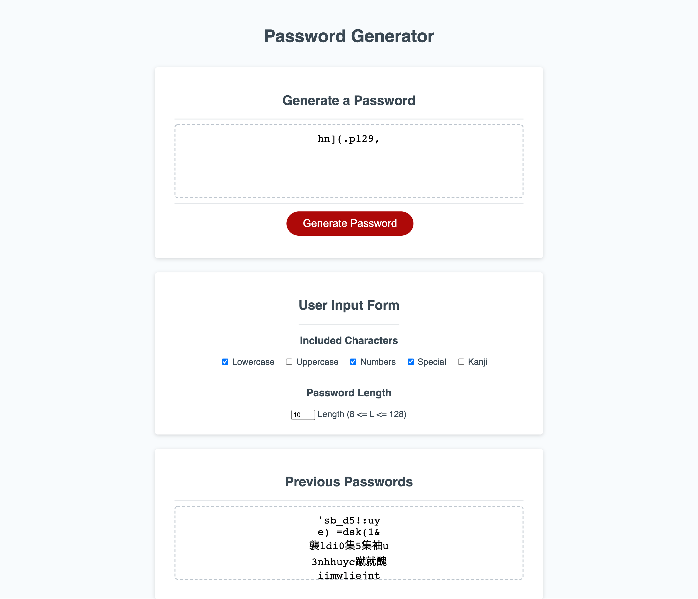

# Password Generator Implementation

This project implements basic password generator functionality using Javascript and a simple user input form. Password is randomly generated based on user selected character types and desired length.

Instead of the requested series of prompt() generated user input forms, a single static input form was created below the main generate password card. This promotes reusability, and helps the user select the desired character sets more quickly and consistently. Additionally, basic input validation procedures provided by the input form style reduces script complexity (for example, users cannot input non-number characters in the password length box).

## Main Features
- Checkbox user input form to select from lowercase, uppercase, numeric, and special characters. 
- Previously generated passwords are in a card below the user input form.
- Generated password is automatically highlighted for easy copying after generation
- if the user input is invalid (no types selected, or out of range length), the generator field will display an invalid input response and shake the input form.
- Special characters are split into standard special "!_$#%..." etc, and Japanese kanji characters. Kanji characters are likely invalid for true passwords, but are an interesting source of variation.

See the deployed site at: [Password Generator](https://ellisonac.github.io/Password-Generator/)

Capture of the final application:
